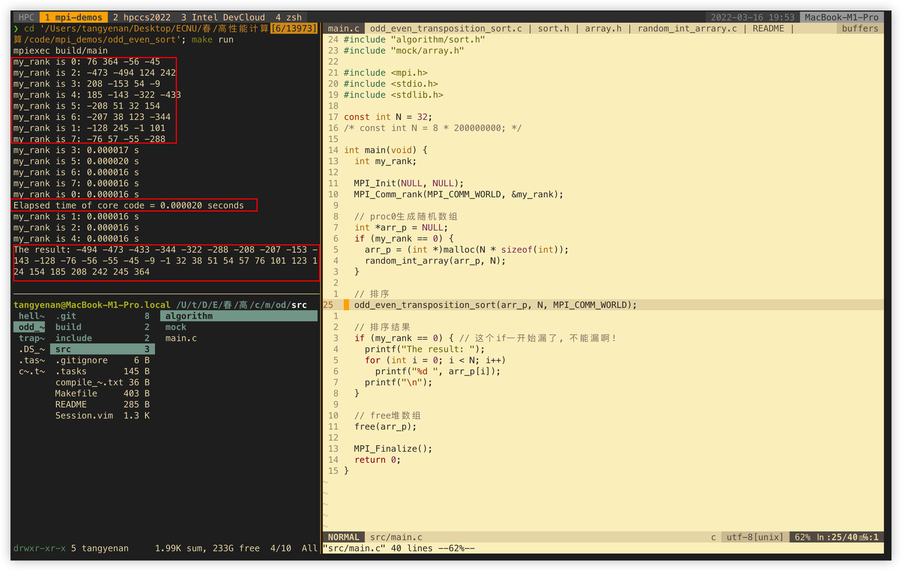

# Quick start
0. you need a C compiler and GNU/make
1. install Open MPI on your OS
2. run `make` to compile the program
3. run `make run` to run the program

# Note
- "compile_flags.txt" is for clangd to identify the locations of head files
- ".tasks" is for [asynctasks.vim](https://github.com/skywind3000/asynctasks.vim)
- directly use `mpiexec -n <N> build/main` to run the program with N processes(N must evenly divides data number in this case)

# Screenshot
